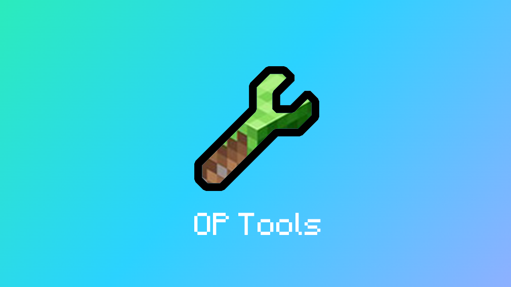

## 前言
为了确保最佳的使用体验，请仔细阅读文档   
遇到问题`请勿在MineBBS评论区`反馈！
> [!NOTE]
> [点我前往MIneBBS OPTools](https://www.minebbs.com/resources/op-tools-op-gui.4836/)    
> [点我加入 反馈/聊天群](https://qm.qq.com/cgi-bin/qm/qr?k=jmd_S7-T9UGiVp9eiPyHtuIuEApwVIq5&authKey=6c4npR7mamU4DP72JQKTYQAIz12vhRXHE4/U6GCriqjtiQpaa3Gf6Q+sYricFR9y&noverify=0)

## 功能一览
- 踢出玩家
- 杀死玩家
- 更改时间
- 更改天气
- 广播消息
- 设置MOTD
- 设置人数
- 清理掉落物（可对接`Cleaner`
- 传送功能
    - 传送玩家
    - 玩家传玩家
    - 玩家传坐标（支持`维度`选择
- 更改游戏模式
- 更改游戏规则
- 获取隐藏方块
- 崩溃玩家客户端
- 更改他人游戏模式
- 以某玩家身份说话
- 执行后台命令
- 玩家身份执行命令
- 发消息给玩家
- Ban GUI（依赖`云黑`
- 发送表单  
- 查看玩家信息

## 命令列表
> [!tip]
> 看不懂？点击左下角查看目录

| 类型       | 命令           | 功能    |
| --------- | -------------- | ------- |
| 玩家命令   | /tools         | 打开GUI |
| 玩家命令   | /tools gui     | 打开GUI |
| 玩家命令   | /tools set     | 设置GUI |
| 控制台命令 | /tools add     | 添加管理 |
| 控制台命令 | /tools remove  | 移除管理 |
| 控制台命令 | /tools reload  | 重载文件 |