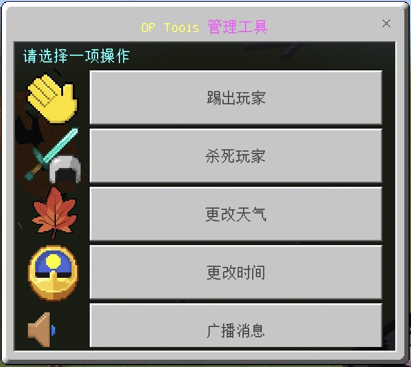

## GUI管理界面

- 请确保你已是`插件管理员/子用户`

在**聊天栏**输入命令`/tools`或`/tools gui`或`optools`即可打开GUI

- 具体功能请自行打开GUI查看，遇到问题请在`MineBBS讨论区`反馈或者`前往反馈群`[点我前往](https://qm.qq.com/cgi-bin/qm/qr?k=jmd_S7-T9UGiVp9eiPyHtuIuEApwVIq5&authKey=6c4npR7mamU4DP72JQKTYQAIz12vhRXHE4/U6GCriqjtiQpaa3Gf6Q+sYricFR9y&noverify=0)

> [!tip]
> 如果报错无权限，请添加自己为插件管理后重试
