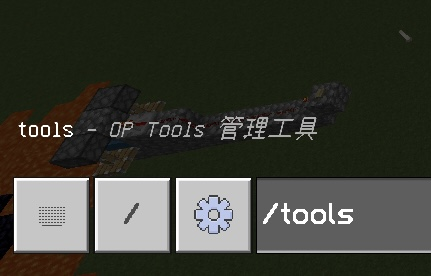

## GUI管理界面
> [!tip]
> 请先添加自己为插件管理员，否则无法打开GUI

在聊天栏中输入
```cmd
/tools
```  


如果你步骤正确将会打开GUI主界面

> [!tip]
> 想知道有什么功能？[点我查看](./README.md)


> 具体功能请自行打开GUI查看，遇到问题请在minebbs讨论区反馈或者前往反馈群

> [!tip]
> 如果报错无权限，请添加自己为插件管理后重试

## 功能详解

> 以下功能均为1.4版本的截图，请以新版本为准！

- 踢出玩家


踢出显示的文字效果


- 杀死玩家


- 更改时间


- 更改天气☁️


- 广播消息📢


普通消息效果


聊天栏效果


物品栏效果


- 设置MOTD


效果


> [!tip]
> 部分基础插件带有MOTD功能，可能导致本插件更改后但不显示更改内容

- 设置人数


> [!warning]
> 仅限输入数字，输入其他内容会导致设置失败

- 清理掉落物

清理命令 /kill @e[type=item]

清理后会输出清理的结果

- 玩家传送


传送玩家


玩家传玩家


玩家传坐标


> [!tip]
> 不支持选择维度

- 更改游戏模式


> [!tip]
> 当选择“更改自己”时，选择的玩家将不可用

- 更改游戏规则


> [!tip]
> 支持自定义图片，详见配置文件  

- 获取隐藏方块


- 以某玩家身份说话


